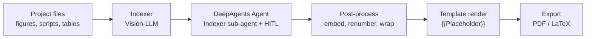

# BIA-Brief

**Automated bioinformatics report generation from analysis outputs.** BIA-Brief transforms project figures, scripts, and metadata into structured, publication-ready reports in Markdown, PDF, and LaTeX — with minimal manual effort.

Optimized for single-cell / single-nucleus transcriptomics (scRNA-seq, snRNA-seq), with pluggable template support for spatial transcriptomics, custom pipelines, and more.

[中文版](README.zh-CN.md)

---

## Features

- :rocket: **End-to-end automation** — from raw analysis figures to final PDF in a single command
- :eye: **Multi-modal Indexer** — vision-language model classifies figures by analysis step, generates captions and section summaries
- :robot: **DeepAgents report pipeline** — DeepAgents orchestration with built-in filesystem/todo/task tools and an Indexer sub-agent
- :busts_in_silhouette: **Human-in-the-Loop (HITL)** — optional interactive review at key stages (indexer output, report outline) with configurable timeout
- :brain: **Smart background assembly** — structured `project_info.md` → deterministic standardized background text; use `项目简介` for domain-specific context
- :page_facing_up: **Multi-format export** — Markdown, PDF (Playwright Chromium), LaTeX (stdlib-only, `ctex` for Chinese)
- :art: **Template system** — reusable templates with `{{Placeholder}}` substitution; built-in families for scRNA-seq, spatial, and standard output
- :stethoscope: **Project health checks** — `doctor.py` validates environment, config, templates, and project structure in under one second
- :runner: **Batch processing** — run multiple projects sequentially with auto-approve and centralized logging
- :package: **Delivery management** — generated PDFs are automatically copied to a centralized `deliverables/` directory

---

## Repository layout

```text
src/Brief/               core library
  ├── pipeline/          runner config & project info parser
  ├── tools/             indexer, file ops, outline review
  ├── utils/             post-process, PDF, LaTeX, template
  ├── agent.py           DeepAgents report agent adapter
  ├── pipeline/agent_runtime.py  runtime assembly and virtual filesystem seam
  ├── config/            model config & credentials
  └── core.py            pipeline orchestrator
scripts/                 entry points (run_project, run_batch, doctor)
projects/<id>/           project inputs and generated outputs
project_template/        starter skeleton for new projects
templates/               report templates and shared assets
  ├── scRNA/             single-cell transcriptomics
  ├── spatial/           spatial transcriptomics
  ├── standard/          standard Markdown output
  └── assets/            shared branding elements
docs/examples/           reference sample files
dist/                    built wheel artifacts (local only)
```

## Architecture



| Stage | Component | What it does |
|---|---|---|
| :mag: **Indexer** | `tools/indexer_tool.py` | Scans `pics/` and `scripts/`, classifies each figure by analysis step (QC :arrow_right: HVG :arrow_right: PCA :arrow_right: Clustering :arrow_right: Markers :arrow_right: Annotation :arrow_right: PAGA), generates captions and section summaries via multi-modal LLM. Cached by SHA256 of background+language. |
| :robot: **Agent** | `agent.py`, `pipeline/agent_runtime.py` | DeepAgents runtime with built-in filesystem/todo/task tools, a dedicated Indexer sub-agent, and the business tool `review_outline`. Reads `index.md`, follows prompt guides, and writes the report body into `{{Body_Content}}`. |
| :busts_in_silhouette: **HITL** | `core.py` | Interrupt-based human review triggered inside `run_indexer` and `review_outline`. Threading.Timer (Windows) / SIGALRM (POSIX) with configurable timeout. Bypassed with `BRIEF_AUTO_APPROVE=1` for batch runs. |
| :wrench: **Post-process** | `utils/postprocess.py` | Base64 figure embedding, automatic renumbering (start_index=2), paragraph wrapping. |
| :framed_picture: **Template** | `utils/parse_md_template.py` | Single-pass regex substitution of `{{Placeholder}}` values. No Jinja2 dependency. |
| :page_with_curl: **PDF** | `utils/md_to_pdf.py` | Playwright Chromium: cover page (no page numbers) + body (page numbers, watermark). TOC page numbers from heading positions. |
| :memo: **LaTeX** | `utils/md_to_latex.py` | Stdlib-only converter. `ctex` for Chinese. Compile with `xelatex report.tex` (two passes for TOC). |

---

## Requirements

- :snake: Python 3.10+ with project dependencies installed
- :globe_with_meridians: [Playwright Chromium](https://playwright.dev/python/) for PDF export (`playwright install chromium`)
- :key: **OpenAI-compatible API endpoints** for both chat and multi-modal models (configured in `src/Brief/config/config.yaml`)

---

## Quick start

Install the package in the active environment:

```powershell
python -m pip install -e .
playwright install chromium
```

After installation, use either the console commands or the compatibility
scripts. The console commands are the supported product interface:

```powershell
bia-brief-doctor --project projects/my_project
bia-brief-project my_project
bia-brief-batch --all
```

For a release wheel:

```powershell
python -m build --wheel
python -m pip install dist\bia_brief-*.whl
```


### 1. Setup :wrench:

```bash
# Clone and install
pip install -r requirements.txt
playwright install chromium

# Create config from template (edit with your API keys)
cp src/Brief/config/config.yaml.example src/Brief/config/config.yaml
```

### 2. Prepare a project :open_file_folder:

```bash
# Create from skeleton
Copy-Item -Recurse project_template projects/my_project

# Or use an existing analysis folder with the following structure:
# projects/my_project/
#   ├── pics/            # analysis figures (required)
#   ├── scripts/         # analysis scripts (optional)
#   ├── tables/          # summary tables (optional)
#   └── project_info.md  # project metadata (optional)
```

### 3. Run health check :stethoscope:

```powershell
python scripts/doctor.py --project my_project
```

### 4. Generate report :rocket:

```powershell
# Preview the background sent to the model
python scripts/run_project.py my_project --print-background

# Generate full report
python scripts/run_project.py my_project
```

### 5. Output :tada:

```
projects/my_project/output/
├── report.md
├── report.pdf
├── report.tex
└── index.md
```

A copy of the final PDF is also placed in `deliverables/<report-title>.pdf`.

---

## Project structure conventions

```
projects/<project_id>/
├── pics/               # required — analysis figures (PNG, JPG, etc.)
│   ├── violin_1_qc.png
│   ├── scatter_2_qc.png
│   ├── umap_6_leiden.png
│   └── ...
├── scripts/            # optional — analysis scripts (py, R, ipynb)
│   ├── 1.datapp.py
│   └── 2.anno.py
├── tables/             # optional — CSV tables (table1_project_info.csv, etc.)
│   ├── table1_project_info.csv
│   └── table2_sequencing_quality.csv
└── project_info.md     # optional — project metadata
```

### `project_info.md` :memo:

This file drives the background context passed to the report agent. Fields filled in by the user are used directly. Empty fields are skipped; `项目简介` is the main place to provide the biological question, tissue/cell context, and project-specific interpretation target.

Recommended fields:

```
项目名称：Example single-cell project
报告名称：Example scRNA-seq collaboration report
合同编号：CONTRACT-2025-001
物种：Mus musculus
参考基因组：GRCm39
样本数量：12
测序技术：scRNA-seq
项目简介：         ← optional but recommended; add domain-specific context here
样本ID：
SAMPLE001
...
```

Preview the assembled background without running the model:

```powershell
python scripts/run_project.py my_project --print-background
```

---

## Runner commands

### Single project :arrow_forward:

```powershell
python scripts/run_project.py <project_id>
python scripts/run_project.py D:/path/to/project --template templates/spatial/report.md
```

### Batch mode :arrows_counterclockwise:

```powershell
python scripts/run_batch.py --all
python scripts/run_batch.py project_a project_b
```

### Key flags :flags:

| Flag | Effect |
|---|---|
| `--template spatial` | Template key from `run_config.yaml` (scRNA, spatial, standard) |
| `--lang en` | Output language |
| `--background "..."` | Override the auto-built background text |
| `--print-background` | Preview background without running the pipeline |
| `--interactive-review` | Enable manual HITL review prompts |
| `--no-delivery-copy` | Skip copying PDF to `deliverables/` |
| `--config run_config.yaml` | Custom runner config path |
| `--stop-on-failure` | (Batch) abort on first error |

---

## Templates :art:

Template families are grouped under `templates/`:

```
templates/
├── scRNA/             # single-cell transcriptomics
├── spatial/           # spatial transcriptomics
├── standard/          # standard Markdown output
└── assets/
    └── BGI_SY/        # shared branding assets (covers, logos, workflow figures)
```

Use `--template <key>` to select a template by name, or provide an explicit path:

```powershell
python scripts/run_project.py my_project --template spatial
python scripts/run_project.py my_project --template templates/scRNA/report.md
```

---

## Configuration: two-layer system :gear:

| Layer | File | Purpose |
|---|---|---|
| **Runner** | `run_config.yaml` | Project root, default template/language, batch log dir, auto-approve behavior |
| **Model** | `src/Brief/config/config.yaml` | API keys, base URLs, model names, thinking/search flags |

`setup_brief()` auto-creates `config.yaml` from `config.yaml.example` on first run if it is missing. The runner config (`run_config.yaml`) ships with sensible defaults and can be overridden per invocation with `--config`.

---

## Typical workflow :dart:

1. :open_file_folder: Place analysis figures in `projects/<project_id>/pics/`
2. :pencil: (Optional) Fill in `project_info.md` — at minimum the species, sample count, and project name
3. :key: Configure API credentials in `src/Brief/config/config.yaml`
4. :stethoscope: Run `python scripts/doctor.py --project <project_id>` to verify readiness
5. :eye: Preview the background: `python scripts/run_project.py <project_id> --print-background`
6. :rocket: Generate report: `python scripts/run_project.py <project_id>`
7. :white_check_mark: Review `projects/<project_id>/output/report.md` and the PDF in `deliverables/`

---

---

## Notes :bookmark:

- The core runtime is packaged as `bia-brief`. A separate `bia-brief-report` Skill can call the installed CLI without copying runtime source code.
- `logs/` and `deliverables/` are gitignored; `deliverables/` is auto-created at runtime.
- Batch logs are written to `logs/batch/<timestamp>_<project>.log`.
- The project template skeleton at `project_template/` includes `.gitkeep` files to preserve the directory structure.

---

## Troubleshooting :warning:

| Symptom | Likely cause |
|---|---|
| :x: PDF export fails | Playwright Chromium not installed (`playwright install chromium`) |
| :x: Doctor reports missing project | Project lacks `figures/` or `pics/` directory |
| :x: Template not found | Wrong key or path — use `templates/scRNA/report.md`, `templates/spatial/report.md`, or `templates/standard/report.md` |
| :x: Chinese text garbled in PDF | Missing Chinese font — ensure `ctex` LaTeX package or system CJK font |
| :x: Indexer returns empty cache miss | Multi-modal model unavailable — check API key and base URL in `config.yaml` |
| :x: GBK encoding error on Windows | Set `PYTHONIOENCODING=utf-8` or use a UTF-8 terminal |

---

## License

See [LICENSE](LICENSE).

## Agent runtime

The report workflow uses DeepAgents 0.6.x as the orchestration layer. It keeps
LangChain model adapters and LangGraph checkpointing underneath, uses built-in
filesystem/todo/task tools, and runs the project Indexer as a sub-agent. Indexer
and outline review remain available through the existing HITL and
`BRIEF_AUTO_APPROVE=1` modes.
