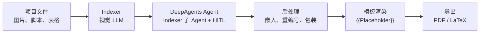

# BIA-Brief

**自动化生物信息学报告生成工具。** BIA-Brief 将项目图片、脚本和元数据转化为结构化、可发表的 Markdown、PDF 和 LaTeX 报告，只需极少量人工介入。

针对单细胞 / 单细胞核转录组（scRNA-seq, snRNA-seq）优化，同时通过可扩展模板系统支持空间转录组、商业分析流程和自定义场景。

English version: [README.md](README.md)

---

## 功能特性

- 🚀 **端到端自动化** — 从分析图片到最终 PDF，一条命令完成
- 👁 **多模态 Indexer** — 视觉语言模型自动对图片按分析步骤分类，生成标题和段落摘要
- 🤖 **DeepAgents 报告流水线** — 使用 DeepAgents 编排层、内置文件/todo/task 工具，并将 Indexer 拆为子 Agent
- 👥 **人在回路（HITL）** — 在 Indexer 输出和大纲生成阶段可选人工审阅，支持超时自动继续
- :brain: **智能背景组装** — 结构化 `project_info.md` → 确定性的标准化背景文本；用 `项目简介` 补充具体研究语境
- 📄 **多格式导出** — Markdown、PDF（Playwright Chromium）、LaTeX（纯标准库，`ctex` 中文支持）
- 🎨 **模板系统** — 可复用的 `{{Placeholder}}` 模板引擎；内置 scRNA、spatial、standard 三套模板
- :stethoscope: **项目健康检查** — `doctor.py` 一秒内完成环境、配置、模板和项目结构验证
- 🏃 **批量处理** — 支持多项目顺序运行，自动审阅通过，集中日志
- 📦 **交付物管理** — 生成 PDF 自动归档到统一 `deliverables/` 目录

---

## 仓库结构

```text
src/Brief/               核心库
  ├── pipeline/          运行配置解析、项目信息背景组装
  ├── tools/             Indexer、文件操作、大纲审阅
  ├── utils/             后处理、PDF、LaTeX、模板渲染
  ├── agent.py           DeepAgents 报告 Agent 适配器
  ├── pipeline/agent_runtime.py  运行时装配和虚拟文件 seam
  ├── config/            模型配置与凭据
  └── core.py            流水线编排器
scripts/                 入口脚本（run_project, run_batch, doctor）
projects/<id>/           项目输入和生成输出
project_template/        新项目骨架
templates/               报告模板和共享资源
  ├── scRNA/             单细胞转录组
  ├── spatial/           空间转录组
  ├── standard/          标准 Markdown 输出参考
  └── assets/            共享品牌元素
docs/examples/           参考样例文件
dist/                    本地构建的 wheel 文件
```

## 架构设计



| 阶段                 | 组件                           | 职责                                                                                                                                                                                                                                  |
| -------------------- | ------------------------------ | ------------------------------------------------------------------------------------------------------------------------------------------------------------------------------------------------------------------------------------- |
| 🔍 **Indexer** | `tools/indexer_tool.py`      | 扫描`pics/` 和 `scripts/`，按分析步骤（QC ➡️ HVG ➡️ PCA ➡️ Clustering ➡️ Markers ➡️ Annotation ➡️ PAGA）对图片分类，通过多模态模型生成描述和段落摘要。结果按 SHA256（background+lang）缓存。                          |
| 🤖 **Agent**   | `agent.py`、`pipeline/agent_runtime.py` | DeepAgents 编排层，使用内置文件/todo/task 工具，并将 Indexer 拆为子 Agent；读取 `index.md`，依据 prompt 规范撰写报告正文并填入 `{{Body_Content}}`。 |
| 👥 **HITL**    | `core.py`                    | 基于 interrupt 的人工审阅机制。Windows 用`threading.Timer`，POSIX 用 `SIGALRM`，支持超时自动继续。批量模式下通过 `BRIEF_AUTO_APPROVE=1` 跳过。                                                                                  |
| 🔧 **后处理**  | `utils/postprocess.py`       | Base64 图片嵌入、自动重编号（从 2 开始）、段落包装。                                                                                                                                                                                  |
| 🖼 **模板**    | `utils/parse_md_template.py` | 单遍正则替换`{{Placeholder}}`，无 Jinja2 依赖。                                                                                                                                                                                     |
| 📃 **PDF**     | `utils/md_to_pdf.py`         | Playwright Chromium 渲染：封面无页码 + 正文有页码和水印，目录页码从标题位置测量。                                                                                                                                                     |
| 📝 **LaTeX**   | `utils/md_to_latex.py`       | 纯标准库实现。中文通过`ctex` 支持，`xelatex report.tex` 编译（两次生成目录）。                                                                                                                                                    |

---

## 运行要求

- 🐍 Python 3.10+，已安装项目依赖
- 🌐 [Playwright Chromium](https://playwright.dev/python/)（`playwright install chromium`）用于 PDF 导出
- 🔑 **兼容 OpenAI API 的端点**，分别配置文本模型和多模态模型（在 `src/Brief/config/config.yaml` 中设置）

---

## 快速开始

在当前环境安装 BIA-Brief：

```powershell
python -m pip install -e .
playwright install chromium
```

安装后推荐使用产品化命令：

```powershell
bia-brief-doctor --project projects/my_project
bia-brief-project my_project
bia-brief-batch --all
```

构建发布 wheel：

```powershell
python -m build --wheel
python -m pip install dist\bia_brief-*.whl
```

### 1. 环境准备 🔧

```bash
# 克隆并安装依赖
pip install -r requirements.txt
playwright install chromium

# 从模板创建配置文件（填入 API 密钥）
cp src/Brief/config/config.yaml.example src/Brief/config/config.yaml
```

### 2. 准备项目 📂

```powershell
# 从骨架创建
Copy-Item -Recurse project_template projects/my_project

# 或放入已有的分析文件夹，结构如下：
# projects/my_project/
#   ├── pics/             分析结果图（必需）
#   ├── scripts/          分析脚本（可选）
#   ├── tables/           汇总表格（可选）
#   └── project_info.md   项目元数据（可选）
```

### 3. 运行健康检查 :stethoscope:

```powershell
python scripts/doctor.py --project my_project
```

### 4. 生成报告 🚀

```powershell
# 预览将要传给模型的背景文本
python scripts/run_project.py my_project --print-background

# 生成完整报告
python scripts/run_project.py my_project
```

### 5. 输出文件 🎉

```
projects/my_project/output/
├── report.md
├── report.pdf
├── report.tex
└── index.md
```

最终 PDF 还会自动复制到 `deliverables/<报告标题>.pdf`。

---

## 项目结构约定

```
projects/<project_id>/
├── pics/               必需 — 分析结果图（PNG, JPG 等）
│   ├── violin_1_qc.png
│   ├── scatter_2_qc.png
│   ├── umap_6_leiden.png
│   └── ...
├── scripts/            可选 — 分析脚本（py, R, ipynb）
│   ├── 1.datapp.py
│   └── 2.anno.py
├── tables/             可选 — CSV 表格
│   ├── table1_project_info.csv
│   └── table2_sequencing_quality.csv
└── project_info.md     可选 — 项目元数据
```

### `project_info.md` 📝

该文件是报告 Agent 获取项目背景的主要来源。用户填写的字段会被直接使用；空字段会被跳过，不会由 LLM 自动补全。`项目简介` 是补充生物学问题、组织/细胞背景和项目特异解读目标的主要位置。

建议字段：

```
项目名称：Example single-cell project
报告名称：Example scRNA-seq collaboration report
合同编号：CONTRACT-2025-001
物种：Mus musculus
参考基因组：GRCm39
样本数量：12
测序技术：scRNA-seq
项目简介：          ← 可选但建议填写，用于提供项目特异研究语境
样本ID：
SAMPLE001
...
```

预览组装的背景文本：

```powershell
python scripts/run_project.py my_project --print-background
```

---

## 运行命令

### 单项目 ▶️

```powershell
python scripts/run_project.py <project_id>
python scripts/run_project.py D:/path/to/project --template templates/spatial/report.md
```

### 批量 🔄

```powershell
python scripts/run_batch.py --all
python scripts/run_batch.py project_a project_b
```

### 常用参数 🎏

| 参数                         | 作用                                                               |
| ---------------------------- | ------------------------------------------------------------------ |
| `--template spatial`       | 使用`run_config.yaml` 中的模板别名（scRNA, spatial, standard） |
| `--lang en`                | 输出语言                                                           |
| `--background "..."`       | 覆盖自动构建的背景文本                                             |
| `--print-background`       | 预览背景文本，不运行流水线                                         |
| `--interactive-review`     | 开启人工审阅（HITL）                                               |
| `--no-delivery-copy`       | 不复制 PDF 到`deliverables/`                                     |
| `--config run_config.yaml` | 指定运行配置路径                                                   |
| `--stop-on-failure`        | （批量）首次失败即停止                                             |

---

## 模板系统 🎨

模板按用途分组在 `templates/` 下：

```
templates/
├── scRNA/             单细胞转录组
├── spatial/           空间转录组
├── standard/         标准 Markdown 输出参考
└── assets/
    └── BGI_SY/        共享品牌资源（封面、logo、技术方法图）
```

通过 `--template <key>` 按名称选择模板，或提供显式路径：

```powershell
python scripts/run_project.py my_project --template spatial
python scripts/run_project.py my_project --template templates/scRNA/report.md
```

---

## 配置体系：双层结构 ⚙️

| 层级             | 文件                             | 用途                                                  |
| ---------------- | -------------------------------- | ----------------------------------------------------- |
| **运行层** | `run_config.yaml`              | 项目根目录、默认模板/语言、批量日志目录、自动审阅行为 |
| **模型层** | `src/Brief/config/config.yaml` | API 密钥、接口地址、模型名称、think/search 开关       |

`setup_brief()` 首次运行时若 `config.yaml` 不存在，会自动从 `config.yaml.example` 创建。运行配置 `run_config.yaml` 内置合理默认值，可通过 `--config` 覆盖。

---

## 典型工作流程 🎯

1. 📂 将分析结果图放入 `projects/<project_id>/pics/`
2. 📝 （可选）填写 `project_info.md` — 至少填写物种、样本量和项目名称
3. 🔑 在 `src/Brief/config/config.yaml` 中配置 API 凭据
4. :stethoscope: 运行 `python scripts/doctor.py --project <project_id>` 确认就绪
5. 👁 预览背景文本：`python scripts/run_project.py <project_id> --print-background`
6. 🚀 生成报告：`python scripts/run_project.py <project_id>`
7. ✅ 查看 `projects/<project_id>/output/report.md` 和 `deliverables/` 中的 PDF

---

## 说明 🔖

- 核心运行时已经封装为 `bia-brief` Python 包。独立的 `bia-brief-report` Skill 只调用已安装的 CLI，不复制核心源码。
- `logs/` 和 `deliverables/` 被 git 忽略；`deliverables/` 在运行时自动创建。
- 批量日志写入 `logs/batch/<timestamp>_<project>.log`。
- `project_template/` 中的 `.gitkeep` 文件用于保留空目录结构。

---

## 常见问题 ⚠️

| 现象                       | 可能原因                                                                                                                       |
| -------------------------- | ------------------------------------------------------------------------------------------------------------------------------ |
| ❌ PDF 导出失败            | 未安装 Playwright Chromium（`playwright install chromium`）                                                                  |
| ❌ Doctor 提示项目缺失     | 项目缺少`figures/` 或 `pics/` 目录                                                                                         |
| ❌ 找不到模板              | 模板别名或路径错误 — 使用`templates/scRNA/report.md`、`templates/spatial/report.md` 或 `templates/standard/report.md` |
| ❌ PDF 中中文乱码          | 缺少中文字体 — 确保`ctex` LaTeX 包或系统 CJK 字体已安装                                                                     |
| ❌ Indexer 返回空结果      | 多模态模型不可用 — 检查`config.yaml` 中的 API 密钥和接口地址                                                                |
| ❌ Windows 下 GBK 编码错误 | 设置`PYTHONIOENCODING=utf-8` 或使用 UTF-8 终端                                                                               |

---

## 许可证

参见 [LICENSE](LICENSE)。

## Agent 运行时

报告流程使用 DeepAgents 0.6.x 作为编排层，同时保留 LangChain 模型适配和
LangGraph checkpoint。通用文件、todo、task 操作使用 DeepAgents 内置工具，
Indexer 作为子 Agent 运行；Indexer 审阅、大纲审阅以及
`BRIEF_AUTO_APPROVE=1` 自动批准模式继续保留。
