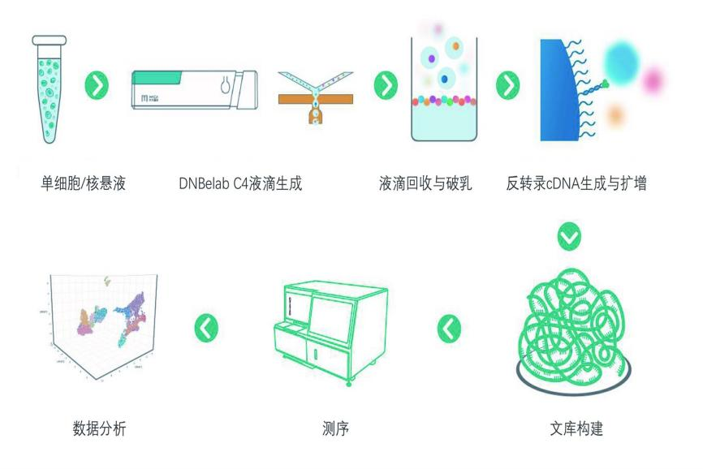

<h2 style="font-size: 15pt;">IDBHT-HNHZ-0351</h2>

<h2>水稻单细胞（核）信息采集及分析</h2>

<h2>2025-07-09</h2>

©2025All Rights Reserved

<!-- __BODY_START__ -->

<section class='toc-block'>
<h2 class='toc-title'>目录</h2>

 分析结果

2

 &emsp;1 技术简介

2

 &emsp;2 项目信息

2

 &emsp;3 测序结果

2

&emsp;&emsp;3.1 下机数据质控

2

&emsp;&emsp;3.2 基因组比对

3

&emsp;&emsp;3.3 基因表达定量

3

 &emsp;4 数据标准化

3

 &emsp;5 高变基因选择和PCA降维

5

&emsp;&emsp;5.1 高变特征筛选

5

&emsp;&emsp;5.2 主成分分析

5

 &emsp;6 单样本分析

7

&emsp;&emsp;6.1 细胞聚类

7

&emsp;&emsp;6.2 Marker基因鉴定

8

&emsp;7 拟时序分析

10

&emsp;8 差异基因表达GO和pathway功能分析

11

分析方法

11

&emsp;1 项目流程

11

&emsp;2 实验流程

11

&emsp;&emsp;2.1 华大DNBelab C4单细胞技术原理

11

&emsp;&emsp;2.2 测序文库结构

12

&emsp;3 信息分析流程

12

&emsp;&emsp;3.1 表达矩阵生成

12

&emsp;&emsp;3.2 数据质控和过滤

12

&emsp;&emsp;3.3 高变特征筛选

13

&emsp;&emsp;3.4 细胞聚类

13

&emsp;&emsp;3.5 cluster中特异marker基因筛选

13

&emsp;&emsp;3.6 分析软件说明

13

帮助

13

&emsp;1 测序下机数据格式

13

&emsp;2 文件交付

13

常见问题

14

参考文献

15

</section>

分析结果

### 1 技术简介

本项目使用华大自主研发的单细胞组学技术（DNBelab C4）[1]，分析目标样本的单细胞水平的转录表达模式，全流程概览如图1所示。

<strong>实验流程：</strong>

1 样本处理及质检：对目标组织样本进行细胞/细胞核悬液制备，并进行细胞/细胞核悬液质控评估；

2 单细胞分离及mRNA分子的捕获：对制备合格的细胞/细胞核悬液通过DNBelab C4的液滴微流控设备，完成液滴的生成，实现单个细胞的分离，液滴生成后破乳回收mRNA分子，并对mRNA分子进行逆转录合成cDNA；

3 文库制备及测序：cDNA合成后构建测序文库并完成测序；

<strong>数据分析：</strong>

针对下机数据进行质控，并完成全套分析，最终得到目标样本细胞/细胞核水平表达的基因信息。

图1 单细胞组学技术流程图。

### 2 项目信息

本项目的信息见表1。

表1 项目信息表 ( 下载)

<table class='report-table' style='width:96%; max-width:1200px; table-layout:fixed; display:table; margin:0 auto 12px auto; border-collapse:collapse; border-spacing:0; border:none; border-bottom:1px solid #7c97c8;'>
<colgroup>
<col style='width:28%;'>
<col style='width:72%;'>
</colgroup>
<tbody>
<tr style='background:#1f5a9e;'>
<th style='border:none; background:#1f5a9e; color:#fff; padding:4px 12px; text-align:center; font-weight:normal;'>
信息
</th>
<th style='border:none; background:#1f5a9e; color:#fff; padding:4px 12px; text-align:center; font-weight:normal;'>
内容
</th>
</tr>
<tr>
<td style='border:none; padding:4px 12px;'>
合同编号
</td>
<td style='border:none; padding:4px 12px;'>
IDBHT-HNHZ-0351
</td>
</tr>
<tr>
<td style='border:none; padding:4px 12px;'>
项目名称
</td>
<td style='border:none; padding:4px 12px;'>
水稻单细胞（核）信息采集及分析
</td>
</tr>
<tr>
<td style='border:none; padding:4px 12px;'>
物种名称
</td>
<td style='border:none; padding:4px 12px;'>
水稻(Oryza sativa)
</td>
</tr>
<tr>
<td style='border:none; padding:4px 12px;'>
参考基因组
</td>
<td style='border:none; padding:4px 12px;'>
IRGSP-1.0
</td>
</tr>
<tr>
<td style='border:none; padding:4px 12px;'>
样品数目
</td>
<td style='border:none; padding:4px 12px;'>
3
</td>
</tr>
</tbody>
</table>

### 3 测序结果

#### 3.1 下机数据质控

测序数据下机后，会对read1和read2进行数据质控，read1为包含20bp cell barcode以及10bp UMI序列，read2为cDNA序列。 使用dnbc4tools[2]工具对read1和read2进行质控过滤，质控统计结果见表2。

表2 下机数据质控统计结果 ( 下载)

<table class='report-table' style='width:100%; table-layout:fixed; border-collapse:collapse; border-spacing:0; border:none; margin:0 0 12px 0;'>
<colgroup>
<col style='width:12%;'>
<col style='width:24%;'>
<col style='width:21%;'>
<col style='width:21%;'>
<col style='width:22%;'>
</colgroup>
<thead>
<tr>
<th style='border:1px solid #7c97c8; background:#1f5a9e; color:#fff; padding:3px 10px; text-align:left; font-weight:700; white-space:normal; overflow-wrap:anywhere; word-break:break-word;'>
Sample
</th>
<th style='border:1px solid #7c97c8; background:#1f5a9e; color:#fff; padding:3px 10px; text-align:left; font-weight:700; white-space:normal; overflow-wrap:anywhere; word-break:break-word;'>
Number of Raw Fragments
</th>
<th style='border:1px solid #7c97c8; background:#1f5a9e; color:#fff; padding:3px 10px; text-align:left; font-weight:700; white-space:normal; overflow-wrap:anywhere; word-break:break-word;'>
Q30 Bases in Barcode
</th>
<th style='border:1px solid #7c97c8; background:#1f5a9e; color:#fff; padding:3px 10px; text-align:left; font-weight:700; white-space:normal; overflow-wrap:anywhere; word-break:break-word;'>
Q30 Bases in RNA Read
</th>
<th style='border:1px solid #7c97c8; background:#1f5a9e; color:#fff; padding:3px 10px; text-align:left; font-weight:700; white-space:normal; overflow-wrap:anywhere; word-break:break-word;'>
Q30 Bases in UMI
</th>
</tr>
</thead>
<tbody>
<tr>
<td style='border:1px solid #7c97c8; padding:4px 10px; text-align:left; white-space:normal; overflow-wrap:anywhere; word-break:break-word;'>
Sample1
</td>
<td style='border:1px solid #7c97c8; padding:4px 10px; text-align:left; white-space:normal; overflow-wrap:anywhere; word-break:break-word;'>
837023054
</td>
<td style='border:1px solid #7c97c8; padding:4px 10px; text-align:left; white-space:normal; overflow-wrap:anywhere; word-break:break-word;'>
94.03%
</td>
<td style='border:1px solid #7c97c8; padding:4px 10px; text-align:left; white-space:normal; overflow-wrap:anywhere; word-break:break-word;'>
94.28%
</td>
<td style='border:1px solid #7c97c8; padding:4px 10px; text-align:left; white-space:normal; overflow-wrap:anywhere; word-break:break-word;'>
95.77%
</td>
</tr>
</tbody>
</table>

Sample: 样本名；

Number of Fragments：测序的总reads数；

Q30 Bases in Barcode：Barcode测序质量在Q30以上的碱基比例；

Q30 Bases in RNA Read: 插入RNA片段的测序质量在Q30以上的碱基比例； 

Q30 Bases in UMI: UMI测序质量在Q30以上的碱基比例；

#### 3.2 基因组比对

使用dnbc4tools[2]软件将Clean Reads与参考基因组进行比对，统计比对到外显子区、内含子区、基因间区等区域的reads数。比对结果见表3。

表3 Clean Reads与参考基因组的比对结果统计 ( 下载)

<table class='report-table' style='width:100%; table-layout:fixed; border-collapse:collapse; border-spacing:0; border:none; margin:0 0 12px 0;'>
<colgroup>
<col style='width:12%;'>
<col style='width:18%;'>
<col style='width:23%;'>
<col style='width:23%;'>
<col style='width:24%;'>
</colgroup>
<thead>
<tr>
<th style='border:1px solid #7c97c8; background:#1f5a9e; color:#fff; padding:3px 10px; text-align:left; font-weight:700; white-space:normal; overflow-wrap:anywhere; word-break:break-word;'>
Sample
</th>
<th style='border:1px solid #7c97c8; background:#1f5a9e; color:#fff; padding:3px 10px; text-align:left; font-weight:700; white-space:normal; overflow-wrap:anywhere; word-break:break-word;'>
Mapping to Genome
</th>
<th style='border:1px solid #7c97c8; background:#1f5a9e; color:#fff; padding:3px 10px; text-align:left; font-weight:700; white-space:normal; overflow-wrap:anywhere; word-break:break-word;'>
Reads Mapped to Exonic Regions
</th>
<th style='border:1px solid #7c97c8; background:#1f5a9e; color:#fff; padding:3px 10px; text-align:left; font-weight:700; white-space:normal; overflow-wrap:anywhere; word-break:break-word;'>
Reads Mapped to Intronic Regions
</th>
<th style='border:1px solid #7c97c8; background:#1f5a9e; color:#fff; padding:3px 10px; text-align:left; font-weight:700; white-space:normal; overflow-wrap:anywhere; word-break:break-word;'>
Reads Mapped to Intergenic Regions
</th>
</tr>
</thead>
<tbody>
<tr>
<td style='border:1px solid #7c97c8; padding:4px 10px; text-align:left; white-space:normal; overflow-wrap:anywhere; word-break:break-word;'>
Sample1
</td>
<td style='border:1px solid #7c97c8; padding:4px 10px; text-align:left; white-space:normal; overflow-wrap:anywhere; word-break:break-word;'>
100.0%
</td>
<td style='border:1px solid #7c97c8; padding:4px 10px; text-align:left; white-space:normal; overflow-wrap:anywhere; word-break:break-word;'>
76.6%
</td>
<td style='border:1px solid #7c97c8; padding:4px 10px; text-align:left; white-space:normal; overflow-wrap:anywhere; word-break:break-word;'>
3.2%
</td>
<td style='border:1px solid #7c97c8; padding:4px 10px; text-align:left; white-space:normal; overflow-wrap:anywhere; word-break:break-word;'>
20.2%
</td>
</tr>
</tbody>
</table>

Sample: 样本名；

Reads Mapped to Genome：比对到基因组上的reads比例；

Reads Mapped to Exonic Regions：比对到外显子区域的reads比例；

Reads Mapped to Intronic Regions：比对到内含子区域的reads比例；

Reads Mapped to Intergenic Regions：比对到基因间区的reads比例。

#### 3.3 基因表达定量

使用dnbc4tools[2]软件，将比对到参考基因组唯一位置的reads (Uniquely Mapping Reads) 与基因的对应关系以及基因表达量 (UMI数量)进行统计， 得到每个细胞基因捕获情况， 具体结果见表4。

表4 基因捕获情况统计 ( 下载)

<table class='report-table' style='width:100%; table-layout:fixed; border-collapse:collapse; border-spacing:0; border:none; margin:0 0 12px 0;'>
<colgroup>
<col style='width:12%;'>
<col style='width:16%;'>
<col style='width:15%;'>
<col style='width:15%;'>
<col style='width:15%;'>
<col style='width:15%;'>
<col style='width:12%;'>
</colgroup>
<thead>
<tr>
<th style='border:1px solid #7c97c8; background:#1f5a9e; color:#fff; padding:3px 10px; text-align:left; font-weight:700; white-space:normal; overflow-wrap:anywhere; word-break:break-word;'>
Sample
</th>
<th style='border:1px solid #7c97c8; background:#1f5a9e; color:#fff; padding:3px 10px; text-align:left; font-weight:700; white-space:normal; overflow-wrap:anywhere; word-break:break-word;'>
Estimated Number of Cells
</th>
<th style='border:1px solid #7c97c8; background:#1f5a9e; color:#fff; padding:3px 10px; text-align:left; font-weight:700; white-space:normal; overflow-wrap:anywhere; word-break:break-word;'>
Fraction Reads in Cells
</th>
<th style='border:1px solid #7c97c8; background:#1f5a9e; color:#fff; padding:3px 10px; text-align:left; font-weight:700; white-space:normal; overflow-wrap:anywhere; word-break:break-word;'>
Mean Reads per Cell
</th>
<th style='border:1px solid #7c97c8; background:#1f5a9e; color:#fff; padding:3px 10px; text-align:left; font-weight:700; white-space:normal; overflow-wrap:anywhere; word-break:break-word;'>
Median Genes per Cell
</th>
<th style='border:1px solid #7c97c8; background:#1f5a9e; color:#fff; padding:3px 10px; text-align:left; font-weight:700; white-space:normal; overflow-wrap:anywhere; word-break:break-word;'>
Total Genes Detected
</th>
<th style='border:1px solid #7c97c8; background:#1f5a9e; color:#fff; padding:3px 10px; text-align:left; font-weight:700; white-space:normal; overflow-wrap:anywhere; word-break:break-word;'>
Median UMI Counts per Cell
</th>
</tr>
</thead>
<tbody>
<tr>
<td style='border:1px solid #7c97c8; padding:4px 10px; text-align:left; white-space:normal; overflow-wrap:anywhere; word-break:break-word;'>
Sample1
</td>
<td style='border:1px solid #7c97c8; padding:4px 10px; text-align:left; white-space:normal; overflow-wrap:anywhere; word-break:break-word;'>
16555
</td>
<td style='border:1px solid #7c97c8; padding:4px 10px; text-align:left; white-space:normal; overflow-wrap:anywhere; word-break:break-word;'>
38.15%
</td>
<td style='border:1px solid #7c97c8; padding:4px 10px; text-align:left; white-space:normal; overflow-wrap:anywhere; word-break:break-word;'>
13610
</td>
<td style='border:1px solid #7c97c8; padding:4px 10px; text-align:left; white-space:normal; overflow-wrap:anywhere; word-break:break-word;'>
1492
</td>
<td style='border:1px solid #7c97c8; padding:4px 10px; text-align:left; white-space:normal; overflow-wrap:anywhere; word-break:break-word;'>
36213
</td>
<td style='border:1px solid #7c97c8; padding:4px 10px; text-align:left; white-space:normal; overflow-wrap:anywhere; word-break:break-word;'>
2112
</td>
</tr>
</tbody>
</table>

Sample: 样本名

Estimated Number of Cells：细胞数量估计；

Fraction Reads in Cells：细胞中reads的比例；

Mean Reads per Cell：平均每个细胞中的reads数量；

Median Genes per Cell：平均每个细胞中的基因数；

Total Genes Detected：检测到的基因总数；

Median UMI Counts per Cell：平均每个细胞中UMI的数量。

### 4 数据标准化

对单个样品的不同文库分别质控， 满足质控标准后合并用于后续分析。 通过可视化细胞的基因分布图， UMI分布图， 可以评估每个样品的细胞活性及基因表达况。线粒体RNA比例， RNA数量和表达量在一定程度上可以反映出细胞活性和质量。 一般来说， 线粒体RNA比例越低、 RNA数量越多、 RNA表达量越高的细胞， 其活性和质量越好。

图2 mRNA和线粒体RNA相关性散点图。

X 轴 mRNA 表达量，Y 轴表示基因表达的数量。图中数字表示相关性系数。

图3 QC小提琴图。

左图：表示基因表达的数量小提琴图；右图：表示基因表达量小提琴。

根据定量结果进行数据过滤， 过滤掉mRNA表达量过低或过高， 以及线粒体RNA比例过高的细胞， 详见信息分析流程-数据质控和过滤， 过滤后的数据集对细胞内所有基因的表达量进行均一化用于后续分析。

### 5 高变基因选择和PCA降维

#### 5.1 高变特征筛选

我们会利用每个样本基于所有基因平均值和分散度（均值和方差）筛选出那些在数据中呈现高变异度的基因，用于下游的 PCA 分析。默认挑选变异程度最高 的 2000 个基因。每个基因分散度的计算方法：基于所有基因的平均表达量将基因划分到 20 个区间，每个区间内基因均值的方差和中位值方差之差的绝对值即为该群基因的分散度的归一化值。

图4 高变基因筛选图。

X轴表示平均表达量,Y轴表示标准化方差。

#### 5.2 主成分分析

维度热图展示了主成分（ PC） 的变异最大的基因和及其表达量在细胞数据中的异质性， 有助于选择合适的维度进行下游分析。 同时也可以采用折线图 (elbow plot) 决定使用多少个PC来聚类， 以便捕捉到数据中大部分的变化，从本质上说，弯头出现的地方通常是识别大多数变异的阈值。

图5 Top50 PC的elbow plot图。 

 X轴为PC序号， Y轴为标准差。

### 6 单样本分析

#### 6.1 细胞聚类

首先使用PCA对基因的表达矩阵进行降维处理， 之后使用UMAP进行细胞聚类， 生成细胞聚类结果见图6。 该图中每个点代表一个细胞， 空间距离近的点表示这些细胞的基因表达模式比较接近； 颜色根据graph-based聚类算法得到的分类决定， 算法认为同一个cluster内的细胞， 基因表达模式最接近。

图6 不同分辨率下细胞分群的结果。

图7 Leiden算法细胞聚类，分辨率为0.30UMAP图。

#### 6.2 Marker基因鉴定

使用scanpy分别计算每一类细胞与其他类群的差异表达基因(marker 基因)，筛选矫正后p-value&lt;0.05且log2FC(log2 fold change:用于评估平均表达量差异倍数)top10 marker基因用于后续结果可视化。对得到的Marker基因，统计其在不同细胞类群中的表达情况。

图8 scanpy 差异基因top 34 cluster marker gene 注释总表部分结果展示。

横轴为排序情况;纵轴表示每一个基因的得分。

图9 Marker基因表达特征图。

### 7 拟时序分析

细胞轨迹推断（Cell Trajectory Inference），也称为<strong>伪时序分析（Pseudotime Analysis）</strong>，是单细胞组学（如单细胞RNA测序）中的核心计算方法。它的核心作用在于从静态的单细胞数据中重构细胞随时间的动态变化过程，揭示细胞状态如何连续演变（如分化、激活、转化或响应刺激），从而理解生物过程的连续性机制。使用scanpy进行细胞轨迹分析，直接观察不同细胞群之间的轨迹交流情况。可以观察到，一些cluster之间有着较为明显的发育轨迹联系，暗示着一些生物学过程在细胞针对疾病等外界刺激后或者自身分化中发生，这些信息能够为我们解析细胞发育过程提供重要的参考（图 10）

图10 scanpy 细胞群轨迹分析可视化。

### 8 差异基因表达GO和pathway功能分析

异基因表达功能富集分析是单细胞转录组数据解释中的重要一环，其核心目的是挖掘每个细胞亚群中特异性表达基因所涉及的生物学功能及通路，以揭示细胞在生理或病理状态下可能承担的角色。在本研究中，我们利用富集分析方法对各 cluster 的 marker 基因进行了 GO 功能注释和 KEGG 通路富集分析，系统解析其功能特性。GO 分析显示，不同细胞亚群的差异表达基因主要富集于诸如信号转导、代谢调控、细胞周期、激素应答等关键生物过程，提示不同 cluster 在发育分化、应激反应及代谢活动中具有特定功能。Pathway 分析结果进一步表明，多数差异基因显著富集于“植物激素信号转导”、“MAPK 信号通路”、“蛋白质加工”、“抗病相关途径”等典型路径，揭示出这些细胞群在信号应答与调控机制中的潜在作用。这些功能富集结果不仅为我们理解各细胞亚群的功能特征提供了重要线索，也为后续探索细胞发育动态和分子机制研究提供了理论基础和研究方向。

图11 差异表达基因的GO与Pathway富集分析可视化图。

分析方法

### 1 项目流程

从样品接收到项目交付的整体项目流程如下：

图1 项目流程图。

### 2 实验流程

#### 2.1 华大DNBelab C4单细胞技术原理

DNBelab C4 技术是基于负压的液滴微流控系统， 通过引入自主专利的液滴标签技术 (Disc-seq : Droplet-indexed highthroughput single-cell sequencing) ， 将带有标签的捕获磁珠与单个细胞或者细胞核包裹在液滴中， 采用Droplet index的技术实现磁珠的超泊松分布， 在液滴中完成细胞裂解和捕获mRNA或DNA分子及用于识别来自同一液滴磁珠的标签序列， 对cDNA和Droplet index进行文库构建和测序， 即可一次性获得大量细胞的基因表达或染色质开放区基因信息， 如下图所示。

图2 DNBelab C4单细胞技术原理示意图。

#### 2.2 测序文库结构

cDNA经PCR扩增、 酶切、 筛选、 再扩增、 成环、 构建可用于DNBSEQ测序的标准文库后， 进行上机测序。 文库结构如下图所示。

图3 单细胞测序文库结构示意图。

Cell Barcode： 用于标识细胞的人工合成核酸序列； UMI： 用于标识从样本组织捕获到的核酸序列； Poly(dT)： 用于与mRNA poly(A)互补配对的序列； Insert： 捕获的RNA片段

### 3 信息分析流程

测序得到的原始数据称为raw reads。 根据已有的白名单序列， 对cDNA和oligo数据进行过滤和映射。 然后将插入片段部分比对到参考基因组， 统计比对到各个区域的比例， 并进行表达量统计； 基于表达量的结果， 进行细胞聚类， 后续进行marker基因的鉴定、 分析以及高级分析等。

#### 3.1 表达矩阵生成

使用dnbc4tools工具，在经过下机数据质控、基因组比对、基因表达定量等步骤后，获得样本的单细胞水平基因表达矩阵。

#### 3.2 数据质控和过滤

常用的QC过滤条件主要包括：

(1)每个细胞鉴定到的基因的数量： a)低质量细胞或者空液滴通常鉴定到的基因非常少; b)双胞或者多胞的液滴可能会表现出异常高的基因数量。

(2)每个细胞鉴定到的分子数量（与1类似）；

(3)比对到线粒体基因组的比例；

细胞过滤参数：

(1) 过滤掉基因数小于200或者大于最大基因数*90%的细胞；

(2) 过滤掉线粒体reads比例超过5%的细胞(能量需求高的细胞类型需要特殊处理， 如肿瘤组织、 心肌细胞， 一般阈值设置为 20%以上)；

#### 3.3 高变特征筛选

计算出在数据集中表现出细胞间高差异特征的子集（ 即它们在一些细胞中高度表达， 而在其他细胞中低表达） ， 在下游分析中关注这些基因有助于突出单细胞数据集中的生物信号。 默认情况下， 挑选变异程度最高的2000个基因。 这些基因将用于下游分析， 如PCA。

#### 3.4 细胞聚类

首先计算出数据中的主成分， 在因子分析技术中， 变量按其相关性进行分组， 即特定组内的所有变量之间具有高度相关性，但往往与其他组的变量之间相关性较低， 之后根据富集的程度和p值筛选出最显著的主成分， 再根据tSNE或者UMAP（ https://www.nature.com/articles/nbt.4314） 的算法进行非线性降维分析， 将细胞聚成若干类。 默认采用UMAP算法， 原因主要为： UMAP更适合处理大型数据集和复杂的维度信息； 结合了可视化的强大功能和减少数据维度的能力； 除了保留本地结构外， 它还保留了数据的全局结构。（ The Ultimate Guide to 12 Dimensionality Reduction Techniques (with Python codes)）

#### 3.5 cluster中特异marker基因筛选

计算每个cluster和剩下所有细胞的差异表达基因， 筛选参数为：

<pre>min.pct = 0.25, logfc.threshold = 0.25</pre>

#### 3.6 分析软件说明

本项目用到的分析软件见下表:

表1 分析软件的名称、版本和说明 ( 下载)

<table class='report-table'>
<tbody>
<tr>
<th>
软件名称
</th>
<th>
版本
</th>
<th>
说明
</th>
</tr>
<tr>
<td>
DNBelab_C_Series_HT_singlecellanalysis-software
</td>
<td>
v2.1.3
</td>
<td>
用于单细胞数据分析的预处理与表达矩阵生成的软件。 Seurat是一个专用于单细胞测序分析与时空组测序分析的R包，其功能涵盖了数据过滤、数据标准化、去批
</td>
</tr>
<tr>
<td>
Seurat
</td>
<td>
v4.3.0
</td>
<td>
次效应、细胞聚类分析、差异基因分析、细胞周期分析等，功能全面强大、在单细胞测序与时空组测序中获得了广泛应用。
</td>
</tr>
<tr>
<td>
SingleR
</td>
<td>
1.10.0
</td>
<td>
SingleR是一个用于对单细胞RNA-seq测序数据进行细胞类型自动注释的R包。它通过给定的具有已知类型标签的细胞样本作为参考数据集，对测试数据集中与参考集相似的细胞进行标记注释。
</td>
</tr>
<tr>
<td>
clusterProfiler
</td>
<td>
v4.8.2
</td>
<td>
clusterProfiler是一个用来进行多种方法基因富集分析的R包， 如GO、 KEGG等， 并且可以实现富集分析结果的可视化。
</td>
</tr>
</tbody>
</table>

帮助

### 1 测序下机数据格式

华大时空组学Stereomics®技术测序下机数据以FASTQ格式存储。数据示例参见附图3。该文件以4行为单位，代表1条read的信息：第一行有‘@’开头，后面跟随序列的描述信息；第二行是序列；第三行由‘+’开始，后面也可以跟随序列的描述信息，也可不跟；第四行为第二行序列的碱基质量值，两行一一对应，示例如下：

<pre>DP8400023715TLL100000562/2 #序列ID CTTCTGATATACAATCTTAATTTTTGTTTTGTAATTTAAACTTAATAAGTATTTGCCAAAAAATAAAAAAAAAATAAAAAATTAAAAAAAAAAAA
#序列碱基
+
FGHEG5%GDDH9GGGGEF.9G3I:C&#x27;GFF?)-4&#x27;GAIDFG/4IGH=HIFG #序列碱基质量值</pre>

### 2 文件交付

一些很大的原始文件，如原始下机fq、比对的bam、原始基因表达量(gem)等，以及比较大的结果文件，如Lasso/配准得到的组织区域gem、细胞聚类后的rds等，以移动硬盘或者华大云盘的方式交付；目录结构与本报告报告一致；

所有标准分析结果，都已在本报告中体现，每个图表的原文件(包括pdf)，都在对应的目录下，不再单独交付；

详细目录及文件内容如下：

<table class='report-table'>
<tr>
<th colspan='5'>
目录	目录内容	内容文件	交付方式

|-- IDBiotech_result

| |-- Sample1                              样本名称
</th>
</tr>
<tr>
<td colspan='3'>
| | |-- anno_report.csv

| | |-- cDNA.sequencing.csv

| | |-- metrics_summary.xls

| |-- Sample2

| |-- SampleN
</td>
<td>
| | |-- anno_report.csv

| | |-- cDNA.sequencing.csv

| | |-- metrics_summary.xls

| |-- Sample2

| |-- SampleN
</td>
<td>
| | |-- anno_report.csv

| | |-- cDNA.sequencing.csv

| | |-- metrics_summary.xls

| |-- Sample2

| |-- SampleN
</td>
</tr>
<tr>
<td colspan='3'>
| |-- 01.Normalize

| | |-- *pdf
</td>
<td>
| |-- 01.Normalize

| | |-- *pdf
</td>
<td>
| |-- 01.Normalize

| | |-- *pdf
</td>
</tr>
<tr>
<td>
|
</td>
<td>
|
</td>
<td>
|-- *png
</td>
<td colspan='2'>
分析结果png	本报告及本目录
</td>
</tr>
<tr>
<td>
|
</td>
<td>
|
</td>
<td>
-- 02.HvgPCA
</td>
<td colspan='2'>
高变特征筛选	本报告及本目录
</td>
</tr>
<tr>
<td>
|
</td>
<td>
|
</td>
<td>
|-- *pdf
</td>
<td colspan='2'>
分析结果pdf	本报告及本目录
</td>
</tr>
<tr>
<td>
|
</td>
<td>
|
</td>
<td>
|-- *png
</td>
<td colspan='2'>
分析结果png	本报告及本目录
</td>
</tr>
<tr>
<td>
|
</td>
<td>
|
</td>
<td>
-- 03.sSample
</td>
<td colspan='2'>
单样本分析
</td>
</tr>
<tr>
<td>
|
</td>
<td>
|
</td>
<td>
 |-- *pdf
</td>
<td colspan='2'>
分析结果pdf	本报告及本目录
</td>
</tr>
<tr>
<td>
|
</td>
<td>
|
</td>
<td>
 |-- *png
</td>
<td colspan='2'>
分析结果png	本报告及本目录
</td>
</tr>
<tr>
<td>
|
</td>
<td>
|
</td>
<td>
-- 04.GOKEGG
</td>
<td colspan='2'>
功能富集分析
</td>
</tr>
<tr>
<td>
|
</td>
<td>
|
</td>
<td>
 |-- *pdf
</td>
<td colspan='2'>
分析结果pdf	本报告及本目录
</td>
</tr>
<tr>
<td>
|
</td>
<td>
|
</td>
<td>
 |-- *png
</td>
<td colspan='2'>
分析结果png	本报告及本目录
</td>
</tr>
<tr>
<td>
|
</td>
<td>
|
</td>
<td>
-- 05.CellChat
</td>
<td colspan='2'>
拟时序分析
</td>
</tr>
<tr>
<td>
|
</td>
<td>
|
</td>
<td>
|-- *pdf
</td>
<td colspan='2'>
分析结果pdf	本报告及本目录
</td>
</tr>
<tr>
<td>
|
</td>
<td>
|
</td>
<td>
|-- *png
</td>
<td colspan='2'>
分析结果png	本报告及本目录
</td>
</tr>
<tr>
<td colspan='5'>
|-- report.pdf	Pdf版报告
</td>
</tr>
</table>

常见问题

1 <strong>分析结果中主要看哪些QC指标？</strong>

每个细胞基因中位数， 每个细胞的reads数、 UMI数。 这些指标主要跟测序量和细胞数量相关， 一般而言， 模式生物每个细胞鉴定到的基因数在500～ 5000之间；每个细胞的reads在几十K到几百K之间。

2 <strong>一般能找到多少细胞？</strong>

与项目设计中细胞类型， 以及对应的细胞活率等有很大关系， 同时也与项目设计中是否进行细胞药物处理等有关， 一般情况细胞衰亡速度快， 找到的有效细胞数也少。

3 <strong>UMAP指的是？</strong>

一种数据降维方法， 与TSNE相比， UMAP更适合处理大型数据集和复杂的维度信息。 UMAP结合了可视化的强大功能和减少数据维度的能力； 除了保留本地结构外，它还保留了数据的全局结构。

4 <strong>为什么普通样品过滤线粒体比例超过5%， 而肿瘤样品超过20%的才会被过滤？</strong>

高比例的线粒体基因表达是细胞处于应激状态的指标之一， 因此线粒体比例过高常用于判断细胞活性差； 但是肿瘤/心肌细胞/神经细胞/骨骼肌细胞/胰腺分泌细胞等常含有大量线粒体以应对高能量需求， 因此需要上调过滤阈值。

5 <strong>细胞类别可以分为多少类别？</strong>

理论上分类越多越细致， 但是也会增加计算和筛选的复杂度， 所以一般分8到15类。

6 <strong>细胞类别为什么从0开始编号？</strong>

历史原因， c语言设计者用0开始计数数组下标， 之后多种高级语言效仿c语言从0开始计数。

7 <strong>为什么单样品marker基因只统计高表达的？ 为什么在多样品组间marker基因鉴定中， log2FC可能出现负值?</strong>

单样品分析中， 我们关注cluster之间的差异表达基因， 一般认为显著高表达的基因最能代表每个cluster， 更适合做marker基因， 后面分析也更关注高表达这部分。而多样品组间分析中， 我们更关注组间的差异表达基因， 因此筛选的marker基因可能在组1高表达也可能在组2高表达， 即log2FC可能为正值也可能为负值。

参考文献

[1] Liu C, Wu T, Fan F, et al. A portable and cost-effective microfluidic system for massively parallel single-cell transcriptome profiling.bioRxiv, 2019: 818450

[2] DNBelab_C_Series_HT_scRNA-analysis-software

[3] Hao Y, Hao S, Andersen-Nissen E, Mauck WM 3rd, Zheng S, Butler A, Lee MJ, Wilk AJ, Darby C, Zager M, Hoffman P, Stoeckius M, Papalexi E, Mimitou EP, Jain J, Srivastava A, Stuart T, Fleming LM, Yeung B, Rogers AJ, McElrath JM, Blish CA, Gottardo R, Smibert P, Satija R. Integrated analysis of multimodal single-cell data. Cell. 2021 Jun 24;184(13):3573-3587.e29. doi: 10.1016/j.cell.2021.04.048. Epub 2021 May 31. PMID: 34062119; PMCID: PMC8238499.

[4] Aran, D., Looney, A.P., Liu, L. et al. Reference-based analysis of lung single-cell sequencing reveals a transitional profibrotic macrophage. Nat Immunol 20, 163–172 (2019).
